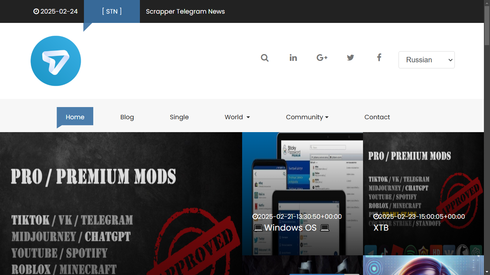
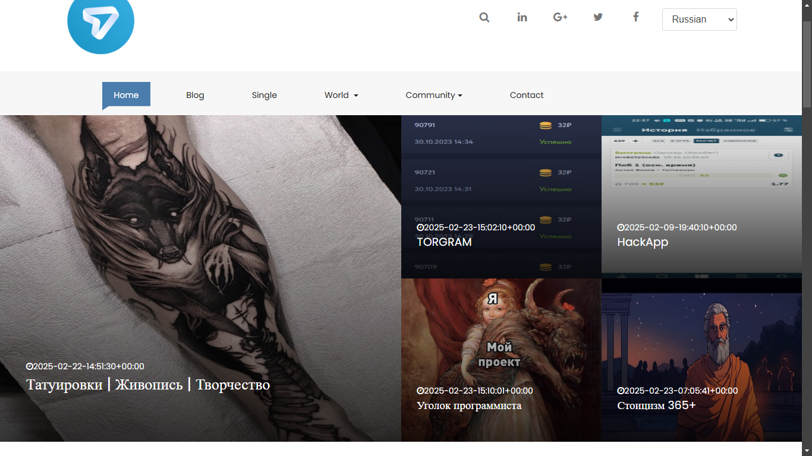
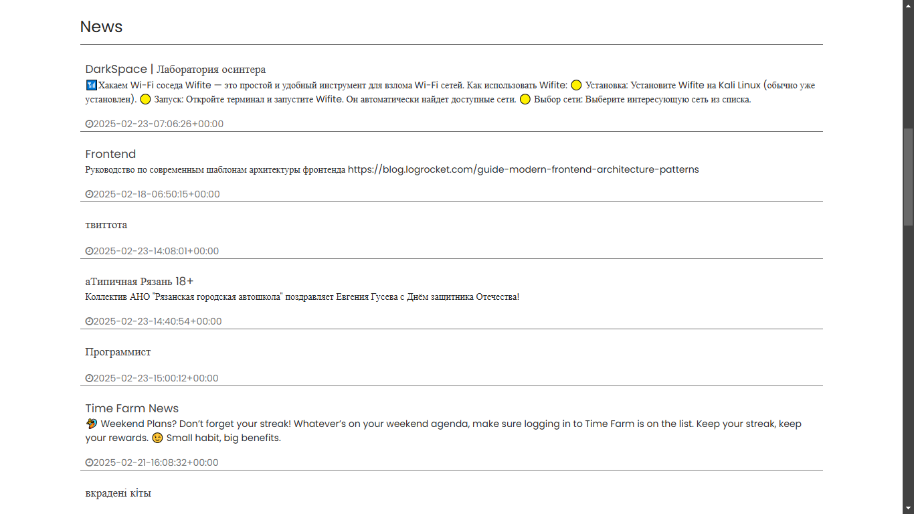
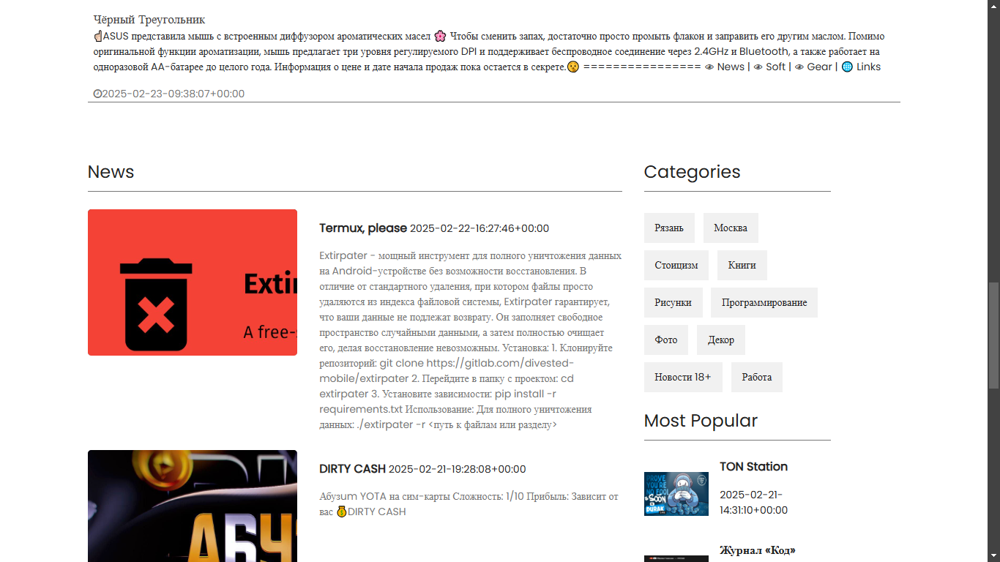
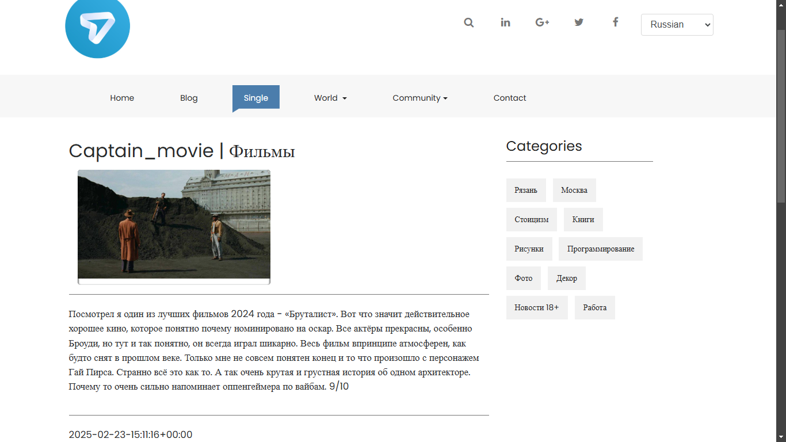
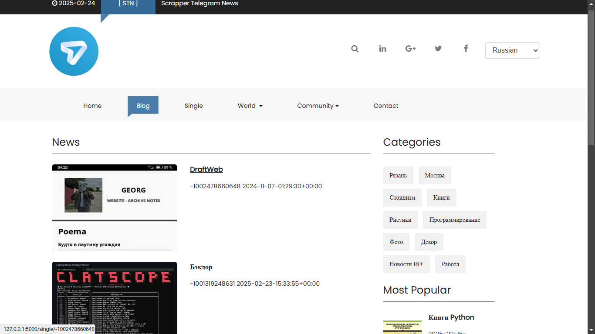

# STN 
# scrapper telegram news

Flask web-panel (site) 
---
> demo youtube video.
```
https://youtu.be/BI1KexO-t8U
```
---
> Work steps:
```
1) Parsed groups and channels from telegram
2) Save list_chats data in json
3) View in site from flask
```
 --- 
> set config file: config.json
```
{
	"api_hash":"your_api_hash",
	"api_id":"your_api_id",
	"delay_sec":1,
	"log_file":"app.log"
}
```

> generate bd and save in file: test.json
```
python service_dialogs.py 1
```

> started web-site 
```
python app.py
```

> move to site-local
```
http://127.0.0.1:5000/index
```
---
> demo screen







